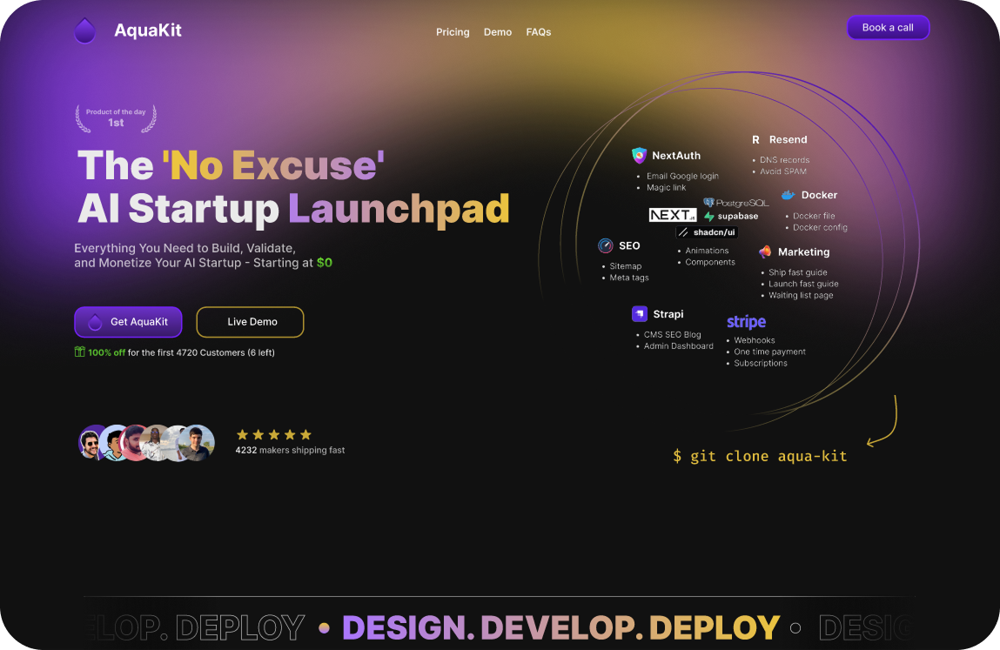

<h1 align="center">AquaKit</h3>

<a name="readme-top"></a>

> **🚧 WORK IN PROGRESS**
>
> This project is currently being built live on YouTube! Follow along and learn as I build this AI SaaS starter kit from scratch.
>
> 📺 **[Subscribe to my YouTube channel](https://www.youtube.com/@0xAquaWolf)** to catch all the episodes
>
> 🎬 **[Watch the complete build series](https://www.youtube.com/watch?v=4Q85SxxnUZc&list=PLwbt1uBf9iqDQyGKEJVj2iA3FFsNxMiXj&pp=gAQB)** - Building AquaKit live!

<!-- PROJECT SHIELDS -->
<div align="center">
<!-- PROJECT SHIELDS -->


</div>

<!-- PROJECT LOGO -->
<br />
<div align="center">

  <p align="center">
    The complete AI SaaS starter kit with the ultimate developer stack - Next.js, TailwindCSS, Claude Code + Cursor, Better Auth, Convex, Trigger.dev, and Polar.sh. Ship your AI SaaS faster than ever.
    <br />
    <a href="#demo">View Demo</a>
    ·
    <a href="https://github.com/0xAquaWolf/AquaKit/issues">Report Bug</a>
    ·
    <a href="https://github.com/0xAquaWolf/AquaKit/issues">Request Feature</a>
  </p>
</div>

<!-- ABOUT THE PROJECT -->

<h2 align="center">About This Project</h3>

<div align="center">



</div>

AquaKit is the ultimate AI SaaS starter kit designed to dramatically accelerate your development process. Built with today's most powerful developer tools - Next.js 15, TailwindCSS, Claude Code + Cursor, Better Auth, Convex, Trigger.dev, and Polar.sh - this starter kit eliminates months of setup and configuration, allowing you to focus on building your unique AI features and getting to market faster.

**The entire stack is optimized for speed:** From AI-powered development with Claude Code and Cursor, to real-time data with Convex, automated workflows with Trigger.dev, and seamless monetization with Polar.sh - every tool is chosen to maximize developer productivity and reduce time-to-market.

Key Features:

- **🚀 Speed-First Development**: AI-powered coding with Claude Code + Cursor for 10x faster development
- **🔐 Authentication Ready**: Better Auth with Convex integration - secure user management out of the box
- **⚡ Real-time Everything**: Convex provides instant data synchronization and serverless functions
- **🤖 Background Jobs**: Trigger.dev for reliable AI processing, webhooks, and scheduled tasks
- **💰 Monetization Built-in**: Polar.sh integration for subscriptions, payments, and customer management
- **🎨 Beautiful UI**: TailwindCSS v4 with modern, responsive components
- **📱 Mobile-First**: Responsive design that works perfectly on all devices
- **🔧 Type-Safe**: Full TypeScript support with strict type checking
- **⚡ Lightning Fast**: Turbopack for ultra-fast development and builds
- **🧠 AI-Ready**: Pre-configured patterns for integrating any AI model or API

<br>
<h3 align="center">Built With</h3>
<div align="center">

### 🧠 AI Development Stack


### 🚀 Frontend Stack


### ⚡ Backend & Infrastructure Stack


### 💰 Monetization Stack


</div>
<br>

<!-- GETTING STARTED -->

## Getting Started

To get a local copy up and running, follow these simple steps.

### Prerequisites

- Node.js (version 18 or higher)
- npm or your preferred package manager

### Environment Variables

To run this project, you will need to add the following environment variables to your `.env.local` file:

```bash
NEXT_PUBLIC_CONVEX_URL="your-convex-deployment-url"
CONVEX_SITE_URL="http://localhost:3000"
```

### Installation

1. Clone the repo
   ```sh
   git clone https://github.com/0xAquaWolf/AquaKit.git
   ```
2. Install packages
   ```sh
   npm install
   ```
3. Start the development server
   ```sh
   npm run dev
   ```

The application will be available at [http://localhost:3000](http://localhost:3000)

<p align="right">(<a href="#readme-top">back to top</a>)</p>

<!-- DEVELOPMENT -->

## Development

### Available Scripts

- `npm run dev` - Start development server with Turbopack
- `npm run debug` - Start development server with Node.js debugger enabled
- `npm run build` - Build for production with Turbopack
- `npm run start` - Start production server
- `npm run lint` - Run ESLint
- `npm run format` - Format code with Prettier
- `npm run format:check` - Check code formatting
- `npm run dev:backend` - Start Convex development server
- `npm run dev:frontend` - Start Next.js with HTTPS and Turbopack

### Architecture Overview

This is a Next.js 15 application with App Router that integrates:

**Authentication Stack:**

- Better Auth with Convex integration (`@convex-dev/better-auth`)
- Auth client configured in `src/lib/auth-client.ts`
- Authentication routes in `src/app/api/auth/[...all]/route.ts`
- Convex auth configuration in `convex/auth.config.ts`

**Convex Integration:**

- Convex backend with Better Auth plugin in `convex/convex.config.ts`
- Client provider wraps the app in `src/app/ConvexClientProvider.tsx`
- Schema definitions in `convex/schema.ts`
- HTTP endpoints in `convex/http.ts`

**Frontend Structure:**

- Next.js App Router with TypeScript
- Tailwind CSS v4 for styling with custom configuration
- UI components in `src/components/ui/`
- Path aliases: `@/*` for `src/*` and `@/convex/*` for `convex/*`

<!-- USAGE EXAMPLES -->

## Usage

AquaKit dramatically reduces development time by providing a complete, pre-integrated stack. Instead of spending weeks configuring tools and services, you can:

- **Ship in days, not months**: Skip the tedious setup and focus on your unique AI features
- **Build with AI assistance**: Claude Code + Cursor provide intelligent code completion and generation
- **Scale effortlessly**: Real-time backend with Convex, background jobs with Trigger.dev
- **Monetize immediately**: Built-in payment and subscription system with Polar.sh
- **Learn the modern stack**: Perfect reference implementation of today's best developer tools

**Perfect for:**

- AI startups wanting to move fast
- Developers building AI-powered SaaS products
- Teams looking to modernize their development stack
- Anyone who wants to ship AI products faster

<!-- ROADMAP -->

## Roadmap

> **🎯 Project Mission: Complete Data Ownership**  
> AquaKit's ultimate goal is to give you **complete ownership of your data**. We believe you should control your infrastructure and data, not be locked into proprietary cloud services. That's why we're building two versions to meet different needs while maintaining the same core principle.

### 🌟 Two Deployment Options

#### ☁️ **Cloud Version** (Current)

The current implementation uses managed cloud services for rapid development and deployment:

- **Convex** for real-time backend and database
- **Better Auth** (package-based, not a service like Clerk)
- **Trigger.dev** cloud for background jobs
- **Polar.sh** for payments and subscriptions

_Perfect for: Getting to market quickly, prototyping, teams that prefer managed services_

#### 🐳 **Dockerized Version** (Coming Soon)

A completely self-hostable version for maximum data ownership:

- **One-click Docker deployment** to any server (Hetzner, DigitalOcean, Fly.io, etc.)
- **Containerized Convex** - self-hosted to own all your data while keeping the same functionality
- **Better Auth** (already package-based, perfect for self-hosting)
- **Self-hosted Trigger.dev** for background job processing
- **Self-hosted payment processing**

_Perfect for: Complete data control, enterprise deployments, privacy-focused organizations_

---

### ✅ Core Stack (Completed)

- [x] Next.js 15 with App Router setup
- [x] Convex backend integration
- [x] Better Auth authentication system
- [x] TypeScript configuration
- [x] TailwindCSS v4 styling
- [x] Development tooling (ESLint, Prettier)
- [x] Claude Code integration guide
- [x] Cursor IDE configuration

### 🚧 AI & Automation Features (In Progress)

- [ ] Trigger.dev background job examples
- [ ] AI integration patterns and examples
- [ ] Claude API integration templates
- [ ] Automated workflow examples

### 💰 Monetization Features (Planned)

- [ ] Polar.sh subscription system integration
- [ ] Payment processing setup
- [ ] User dashboard and analytics
- [ ] Usage tracking and billing

### 🐳 Self-Hosting Features (Major Focus)

- [ ] **Docker containerization** with one-click deployment
- [ ] **Containerized Convex** - self-hosted to maintain full data ownership while keeping all functionality
- [ ] **Better Auth integration** (already package-based, perfect for containerized deployments)
- [ ] **Self-hosted Trigger.dev** for background job processing
- [ ] **Payment system alternatives** for self-hosted deployments
- [ ] **Environment configuration wizard** for easy setup
- [ ] **Health monitoring and logging** for self-hosted instances
- [ ] **Backup and restore utilities** for complete data control

### 🔧 Developer Experience (Planned)

- [ ] Component library expansion
- [ ] Testing suite implementation
- [ ] CI/CD pipeline setup
- [ ] API rate limiting and usage tracking
- [ ] Performance optimization
- [ ] Mobile responsiveness improvements
- [ ] **Migration tools** (Cloud ↔ Self-hosted)
- [ ] **Infrastructure templates** for popular hosting providers

See the [open issues](https://github.com/0xAquaWolf/AquaKit/issues) for a full list of proposed features (and known issues).

<!-- CONTRIBUTING -->

## Contributing

Contributions are what make the open source community such an amazing place to learn, inspire, and create. Any contributions you make are **greatly appreciated**.

If you have a suggestion that would make this better, please fork the repo and create a pull request. You can also simply open an issue with the tag "enhancement".
Don't forget to give the project a star! Thanks again!

1. Fork the Project
2. Create your Feature Branch (`git checkout -b feature/AmazingFeature`)
3. Commit your Changes (`git commit -m 'Add some AmazingFeature'`)
4. Push to the Branch (`git push origin feature/AmazingFeature`)
5. Open a Pull Request

<p align="right">(<a href="#readme-top">back to top</a>)</p>

<!-- LICENSE -->

## License

Distributed under the MIT License. See `LICENSE` for more information.

<!-- CONTACT -->

## Contact

Twitter / X - [@0xAquaWolf](https://twitter.com/0xAquaWolf)

[Aquawolf Academy Discord](https://discord.gg/Y5gvYaw2k5)

<!-- ACKNOWLEDGMENTS -->

## Acknowledgments

### 🧠 AI Development Tools

- [Claude Code Documentation](https://docs.anthropic.com/en/docs/claude-code)
- [Cursor IDE](https://cursor.sh/)

### 🚀 Core Stack Documentation

- [Next.js Documentation](https://nextjs.org/docs)
- [React Documentation](https://react.dev/)
- [TypeScript Documentation](https://www.typescriptlang.org/docs/)
- [TailwindCSS Documentation](https://tailwindcss.com/docs)

### ⚡ Backend & Infrastructure

- [Convex Documentation](https://docs.convex.dev/)
- [Better Auth Documentation](https://www.better-auth.com/)
- [Trigger.dev Documentation](https://trigger.dev/docs)

### 💰 Monetization & Business

- [Polar.sh Documentation](https://docs.polar.sh/)

### 🔧 Additional Tools

- [Zustand Documentation](https://zustand-demo.pmnd.rs/)
- [Turbopack Documentation](https://turbo.build/pack)
- [Lucide React Icons](https://lucide.dev/)

<p align="right">(<a href="#readme-top">back to top</a>)</p>

<!-- MARKDOWN LINKS & IMAGES -->
<!-- https://www.markdownguide.org/basic-syntax/#reference-style-links -->

[product-screenshot]: /public/images/aquakit-preview.png

## Star History

<a href="https://star-history.com/#0xAquaWolf/AquaKit&Date">
 <picture>
   <source media="(prefers-color-scheme: dark)" srcset="https://api.star-history.com/svg?repos=0xAquaWolf/AquaKit&type=Date&theme=dark" />
   <source media="(prefers-color-scheme: light)" srcset="https://api.star-history.com/svg?repos=0xAquaWolf/AquaKit&type=Date" />
   
 </picture>
</a>

## Farewell

Wholeness and balanced Vibrations 🙌
